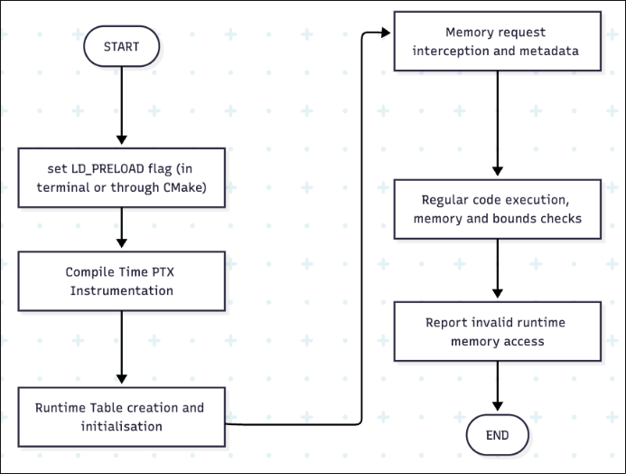
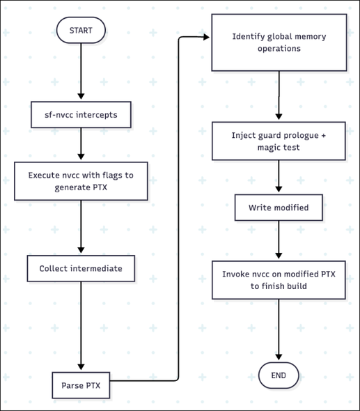

# Summary

Memory safety remains as one of the largest and most difficult to address concerns in the world of programming. This is the case especially for CUDA-based applications that operate at large and distributed scale. Errors such as Buffer Overflow, Use-after- free, Double-free, and race conditions can lead to silent data corruption, unexpected behaviour or complete application failure, and most importantly, memory leaks can lead to many security issues with varying impact. While mature CPU-side tools such as AddressSanitizer [@serebryany:2012] and Valgrind [@nethercote:2007] exist, equivalent solutions for GPUs are limited because of CUDA’s highly decoupled architecture, which often requires source code modifications or specialized hardware to achieve memory safety.

SafeCUDA introduces a software-only memory-safety enforcement system for such CUDA applications, designed to detect and prevent memory-safety related errors without modifying GPU drivers or hardware, or the source code of the project itself. The proposed solution proposes a two-tier validation system, with both the compile-time and run-time processes that validate and check for memory safety issues.

Experimental evaluation shows that SafeCUDA effectively identifies and reports memory safety violations while maintaining low runtime and memory overhead. This, combined with the fact that there is no source code modification or specialized hardware required for the proposed system to function, show that a software-only memory protection system is feasible and achievable for CUDA, thus providing a valuable debugging and verification tool for GPU developers. This work contributes toward safer and more reliable GPU software development by bridging the gap between performance-driven parallel programming and robust memory safety guarantees.

---

# Statement of need

Graphics Processing Units (GPUs) have become a fundamental component in
modern computing, enabling high performance execution of parallel workloads across
fields such as Deep Learning, Data Analytics, Scientific Simulation, etc. However, as applications and projects scale to higher levels of complexity, ensuring memory safety becomes a bigger and bigger challenge, due to the highly decoupled nature of CUDA [@miele:2016]. The split host-device architecture in CUDA brings persistent challenges for developers targeting GPUs to ensure safe memory operations. Prior tools, cuCatch [@ziad:2023] and GPUArmour [@ziad:2025], require specific hardware or a runtime overhead. Software-only solutions, mostly used today, are bound to particular hardware generations and rewriting of the kernels.

SafeCUDA addresses this need by providing a lightweight, drop-in memory safety framework that works transparently with any existing CUDA project. It offers both spatial and temporal safety through the validation of every GPU memory access against its metadata recorded at the time of allocation. Operating entirely through interposition and PTX instrumentation, SafeCUDA integrates seamlessly with existing build systems and workflows, providing an accessible path to safer GPU software.

---

# Implementation and architecture

SafeCUDA has a dual-phase model: runtime interposition and compile-time instrumentation.

1. Runtime layer: A preloaded shared library (`libsafecuda.so`) is added using `LD_PRELOAD` which hooks CUDA runtime APIs such as `cudaMalloc`, `cudaFree`, and `cudaLaunchKernel`. It maintains a shadow metadata table storing base addresses, block sizes, and flags for each allocation. Every access during execution is checked in parallel on the GPU against this metadata to ensure validity. [@henriksen:2021; @lee:2022]

2. Compile-time layer: A compiler wrapper, `sf-nvcc`, intercepts PTX code emitted by the NVIDIA CUDA Compiler and injects bounds-checking instructions for all global memory operations. The wrapper preserves normal build semantics while ensuring every memory load or store call passes through a validation step.

A compact 16-byte header preceding each allocation links memory blocks to metadata entries. Violations are recorded atomically in a reserved table entry and surfaced as a runtime exception at the next synchronization point, mainly `cudaDeviceSynchronize`.

---

# Performance and validation

Evaluation was performed on NVIDIA GTX 1650 Ti and RTX 3060 Ti GPUs with CUDA 12.9. The benchmarking suite was implemented in Python for modularity and reproducibility, orchestrates dual builds: one using vanilla nvcc, the other using sf-nvcc instrumentation. Each build path targets a spectrum of test kernels chosen to represent both familiar and edge-case usage scenarios.

Each test is subject to 5 warm-up runs, discarded to mitigate initialization bias, followed by 500 precise, measured iterations to build robust averages and percentile statistics. The results are stored in CSV format for further analysis and visualization.

Benchmarks encompass:

1. Large vector operations, emulating scientific workloads with contiguous
memory strides
2. Parallel sum reduction, capturing kernel patterns in HPC
3. Memory copy and scaling, reflecting real-world ML preprocessing pipelines
4. Realistic high-compute kernels, typically found in deep learning training and
scientific simulation
5. Synthetic memory stress test (maximizing global memory traffic)
6. Synthetic multi-allocation stress test (fragmented, sparse allocation patterns)

| # | Tool | Mean (ms) | Median (ms) | p_low (ms) | p_high (ms) | Tmin (ms) | Tmax (ms) | Overhead % |
|---|------|------------|-------------|-------------|--------------|------------|------------|-------------|
| 1 | nvcc | 300.749 | 300.037 | 282.261 | 322.302 | 265.386 | 358.500 | 1.613 |
|   | sfnvcc | 305.601 | 304.967 | 286.635 | 326.219 | 274.762 | 353.142 | 1.613 |
| 2 | nvcc | 303.903 | 302.927 | 285.911 | 326.853 | 274.559 | 381.088 | 0.765 |
|   | sfnvcc | 306.229 | 305.003 | 288.196 | 327.579 | 279.251 | 352.858 | 0.765 |
| 3 | nvcc | 303.066 | 302.582 | 281.770 | 326.216 | 269.097 | 340.626 | 4.568 |
|   | sfnvcc | 316.910 | 316.042 | 296.699 | 337.887 | 285.498 | 367.778 | 4.568 |
| 4 | nvcc | 327.359 | 327.188 | 306.121 | 351.574 | 290.211 | 364.239 | 0.737 |
|   | sfnvcc | 329.771 | 328.946 | 307.766 | 354.655 | 299.902 | 373.471 | 0.737 |
| 5 | nvcc | 312.259 | 310.644 | 292.855 | 336.859 | 281.209 | 379.072 | 11.068 |
|   | sfnvcc | 346.821 | 345.683 | 321.741 | 373.270 | 309.254 | 456.770 | 11.068 |
| 6 | nvcc | 355.931 | 351.681 | 330.349 | 401.468 | 311.496 | 427.474 | 17.419 |
|   | sfnvcc | 417.930 | 418.180 | 393.012 | 444.448 | 382.542 | 467.195 | 17.419 |

Average overhead remained below 5% for realistic programs and up to 17% under extreme synthetic tests with excessive allocations. SafeCUDA successfully caught all induced violations, including out-of-bounds and use-after-free errors, demonstrating accurate detection and strong consistency across multiple architectures.

---

# Discussion

SafeCUDA achieves strong memory safety guarantees entirely in software, bridging the gap between high-performance GPU programming and reliable error detection. Its PTX-level integration and LD_PRELOAD runtime interposition make it both portable and transparent, requiring no developer-side code changes.  

Limitations include dependence on Linux environments and potential performance degradation in highly allocation-heavy synthetic workloads. Future work includes extending coverage to shared and texture memory spaces, adding multi-GPU synchronization, and optimizing metadata search using hybrid indexing.

---

# Acknowledgements

The authors thank Dr. Manju G, Associate Professor, School of Computer Science and Engineering, VIT Chennai Campus, for her guidance and supervision.  

---

# References